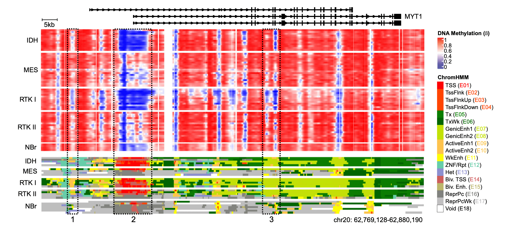
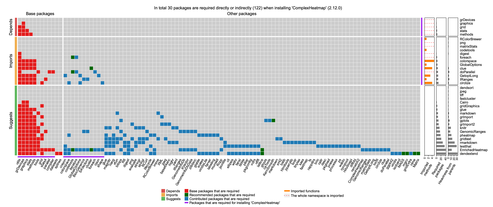

The core of our research lies in applying data science methods to analyze large-scale biological data from interdisciplinary perspectives, including theoretical, applied, and tool-oriented approaches.

## Omics and Precision Medicine

Based on data from public databases and collaborative projects, we conduct multi-omics research in the following three areas: 1. Discovery of novel tumor molecular markers. We have developed statistical methods and software tools based on unsupervised machine learning ([Nucleic Acids Research 2021](https://doi.org/10.1093/nar/gkaa1146)，[Briefings in Bioinformatics 2022](https://doi.org/10.1093/bib/bbac048)), which can identify novel tumor subtypes and molecular markers with more significant prognostic differences. 2. Multi-omics multi-modal integration analysis, including single-cell and other omics data ([Nucleic Acids Research 2025](https://doi.org/10.1093/nar/gkaf435)，[Cancer Discovery 2021](https://doi.org/10.1158/2159-8290.CD-20-1202)，[Nature Immunology 2021](https://doi.org/10.1038/s41590-020-00817-w)，[Nature Communications 2020](https://doi.org/10.1038/s41467-020-20225-w)). 3. Utilizing large language models (LLMs) to enhance the accuracy and generalizability of gene function annotation (<a href="https://doi.org/10.1186/s12864-024-10759-4">BMC Genomics 2025</a>，[Bioinformatics 2023](https://doi.org/10.1093/bioinformatics/btac745)，[Genomics, Proteomics and Bioinformatics 2023](https://doi.org/10.1016/j.gpb.2022.04.008)).

Distribution of DNA methylation and histone modification aroud MYT1 in different subtypes of brain tumors (<a href="https://doi.org/10.1038/s41467-020-20225-w">Nature Communications 2020</a>).

## Bioinformatics Software

Biological software plays a fundamental and central role in precision medicine, artificial intelligence, and biological big data analysis. The software we have developed covers data modeling, visualization, annotation, educational tools, and developer tools, and is widely used by research institutions and pharmaceutical companies worldwide, demonstrating significant impact ([BMC genomics 2024](https://doi.org/10.1186/s12864-024-10759-4)，[Bioinformatics 2023](https://doi.org/10.1093/bioinformatics/btac745)，[Genomics, Proteomics & Bioinformatics 2023](https://doi.org/10.1016/j.gpb.2022.04.008)，[iMeta 2022](https://doi.org/10.1002/imt2.43)，[Briefings in Bioinformatics 2022](https://doi.org/10.1093/bib/bbac048)，[Bioinformatics 2022a](https://doi.org/10.1093/bioinformatics/btab806)，[Bioinformatics 2022b](https://doi.org/10.1093/bioinformatics/btab778)，[Nucleic Acids Research 2021](https://doi.org/10.1093/nar/gkaa1146)，[BMC Genomics 2018](https://doi.org/10.1186/s12864-018-4625-x)，[Bioinformatics 2016a](https://doi.org/10.1093/bioinformatics/btw313)，[Bioinformatics 2016b](https://doi.org/10.1093/bioinformatics/btw161)，[BMC Bioinformatics 2016](https://doi.org/10.1186/s12859-016-1051-4)，[Bioinformatics 2014](https://doi.org/10.1093/bioinformatics/btu393)，[Bioinformatics 2013](https://doi.org/10.1093/bioinformatics/btt008)). We will continue to release software through international open-source communities to enhance the global influence of Chinese-developed software and promote the integration and translational application of large-scale omics platforms.

Examples of the visualization tools. In the plot there are complex heatmaps, interactive heatmaps, circular plot, Hilbert curve, and the spiral plot.

## Computational Geometry and Applications

[Space-filling curve](https://en.wikipedia.org/wiki/Space-filling_curve), as dimensional mapping tools, can fold one-dimensional sequences into two-dimensional or higher-dimensional structures while preserving local proximity between data points. This research direction will systematically conduct comprehensive studies from theoretical exploration to practical applications, focusing on space-filling curves through establishing fundamental mathematical theories, developing applications for biological data, and creating translational platforms ([arXiv 2024](https://doi.org/10.48550/arXiv.2412.16962)).

All 36 types of structures of 2x2 space-filling curves on level = 3.

## Software Ecosystem

From a developer's perspective, we have pioneered the theoretical method of "dependency heaviness" ([Bioinformatics 2022](https://doi.org/10.1093/bioinformatics/btac449)，[Journal of Systems and Software 2023](https://doi.org/10.1016/j.jss.2023.111610)) to address core issues in software ecosystems such as dependency complexity and vulnerability propagation. This research direction will further refine its theoretical framework and extend it to empirical studies and applications in multi-language ecosystems. Dependency heaviness quantitatively characterizes the exclusive dependency burden introduced by a single parent package to its child packages, bridging the gap between macro-level analysis and practical development in existing research, thereby making dependency studies truly serve developers in dependency optimization and risk assessment.

This direction will be developed through two main approaches: applied practice and empirical analysis. First, we will develop a universal core software for cross-programming-language dependency heaviness analysis and an online visualization platform, providing directly actionable tools for dependency optimization and ecosystem health assessment to the global developer community. Second, we will systematically compare dependency propagation patterns and evolutionary trends across mainstream programming language ecosystems, revealing commonalities and differences in ecological complexity.

Dependency analysis on a single R package.

## Bibliometrics

We have developed a novel scientific impact analysis framework based on citation enrichment ([Journal of Informetrics 2025](https://doi.org/10.1016/j.joi.2025.101641)) to reveal structural biases and dynamic evolutionary patterns within the global scientific research system. This research is conducted from both theoretical foundations and practical applications:

Firstly, we establish a statistical theory of citation enrichment based on stochastic citation models to eliminate scale effects in scientific output and quantify genuine preferences among scientific entities. Secondly, leveraging bibliographic database data, we systematically uncover the distribution characteristics of scientific impact across different scientific entity levels and their evolutionary patterns over time. Finally, we develop open-source citation enrichment analysis software and a visualization platform to achieve automated, comprehensive, and reproducible literature data analysis.

Landscape of preference of scientific influence among 72 countries in the globe.

